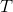

# **Model Predictive Control (MPC)** 

**Model Predictive Controller (MPC) Project**

The goals/steps of this project are the following:
* Build a Model Predictive Controller (MPC) 
* Choose the MPC state, input(s), dynamics, constraints 
* Implement handling of 100-millisecond latency
* Test that the solution can successfully drive around the simulator track once without leaving the road
* Summarize the results with a written report
  * Describe the model in detail including the state, actuators and update equations. 
  * Discuss the reasoning behind the chosen *N* (timestep length) and *dt* (elapsed duration between timesteps) values.   Additionally, provide details on any previous values tried. 
  * Describe any preprocessing performed on the vehicle state, and actuators 
  * Describe how the latency is handled.

---
## Overview

The C++ project solution is a model predictive controller that controls a vehicle within the [Udacity simulator](https://github.com/udacity/self-driving-car-sim/releases).    The starting code provided by Udacity can be found [here](https://github.com/udacity/CarND-MPC-Project).    


### Model Predictive Control

MPC determines an optimal vehicle trajectory given a reference trajectory (i.e., waypoints), current state (e.g., current location, orientation, speed, steering angle, etc.), and a set of constraints (e.g., max/min speed and max/min steering angle).  It then simulates different actuator inputs (e.g., steering and throttle),  predicts the resulting trajectories, and selects the trajectory with the minimum cost compared to the reference trajectory.  The first set of actuator values for the optimal trajectory are then used to control the vehicle.   The vehicle's new state is measured, and the process is repeated.


### Simulator

A screenshot of the simulated vehicle controlled by the MPC is below.   The yellow line is the reference trajectory, and the green line is the selected optimal trajectory calculated by the MPC controller ([MPC.cpp](src/MPC.cpp)).


The [Udacity simulator](https://github.com/udacity/self-driving-car-sim/releases) provides the following data to the controller via WebSocket:

| Value            | Data Type      | Description                                                  |
| ---------------- | -------------- | ------------------------------------------------------------ |
| `ptsx`           | *Array<float>* | The global x positions of the waypoints.                     |
| `ptsy`           | *Array<float>* | The global y positions of the waypoints.                     |
| `psi`            | *float*        | The orientation of the vehicle in **radians**.               |
| `x`              | *float*        | The global x position of the vehicle.                        |
| `y`              | *float*        | The global y position of the vehicle.                        |
| `steering_angle` | *float*        | The current steering angle in **radians**.                   |
| `throttle`       | *float*        | The current throttle value . |
| `speed`          | *float*        | The current velocity in **mph**.                             |

The MPC solution receives the elements described above from the simulator ([main.cpp](src/main.cpp) lines 114-123) and then calculates and returns the following values.

| Value            | Data Type      | Description                                                  |
| ---------------- | -------------- | ------------------------------------------------------------ |
| `steering_angle` | *float*        | The calculated steering angle in **radians**.                |
| `throttle`       | *float*        | The calculated throttle value . |
| `mpc_x`          | *Array<float>* | The x positions of the optimal trajectory calculated by the MPC controller. These values are displayed within the simulator as a **green** line. |
| `mpc_y`          | *Array<float>* | The y positions of the optimal trajectory calculated by the MPC controller. These values are displayed within the simulator as a **green** line. |
| `next_x`         | *Array<float>* | The x positions of the reference trajectory waypoints.  These values are displayed within the simulator as a **yellow** line. |
| `next_y`         | *Array<float>* | The y positions of the reference trajectory waypoints. These values are displayed within the simulator as a **yellow** line. |


### MPC Model Solution

#### MPC Model Setup

The image below shows the MPC solver setup as described in the Udacity class.   The solver's job is to determine the optimal predicted trajectory.


The terms in the image above are described below.

##### *TIME HORIZON TERMS*

| Term                 | Description                                                  |
| -------------------- | ------------------------------------------------------------ |
|   | The prediction horizon. The duration over which future predictions are made (in seconds).  The value should only be a few seconds.  The vehicle's state changes significantly beyond that horizon making predictions unreliable. |
|   | The number of timesteps in the prediction horizon.   More steps can increase the optimizer's prediction accuracy; however the tradeoff is computational cost.   is set in [MPC.cpp](src/MPC.cpp) on line 9. |
|  | The amount of time that elapses between actuations (in seconds) Smaller intervals increase the number of actuations and can increase prediction accuracy; however the tradeoff is computational cost.  is set in [MPC.cpp](src/MPC.cpp) on line 10. |

##### *PREDICTION MODEL TERMS*

| Term                     | Description                                                  |
| ------------------------ | ------------------------------------------------------------ |
|     | The predicted x position of the vehicle at time .  ([MPC.cpp](src/MPC.cpp) line 150) |
|     | The predicted y position of the vehicle at time . ([MPC.cpp](src/MPC.cpp) line 151) |
|   | The predicted vehicle orientation at time . ([MPC.cpp](src/MPC.cpp) line 152) |
|     | The predicted vehicle velocity at time . ([MPC.cpp](src/MPC.cpp) line 153) |
|   | The predicted cross track error at time . ([MPC.cpp](src/MPC.cpp) line 154) |
|  | The predicted orientation error at time . ([MPC.cpp](src/MPC.cpp) line 155) |

##### *COST TERMS*

| Term              | Description                                                  |
| ----------------- | ------------------------------------------------------------ |
|  | The cost function.  The solution's cost function can be found in [MPC.cpp](src/MPC.cpp) lines 80-96. |

##### *CONSTRAINT TERMS*

| Term                  | Description                                                  |
| --------------------- | ------------------------------------------------------------ |
|  | The steering angle constraint.   ([MPC.cpp](src/MPC.cpp) lines 217-220) |
|      | The throttle actuator constraint  ([MPC.cpp](src/MPC.cpp) lines 225-227) |


#### MPC Loop

The image below shows a single pass of the MPC processing loop.  


From left to right, the vehicle's state is received, preprocessed and handed to the MPC controller (`h.onMessage`within [main.cpp](src/main.cpp)).  The MPC controller ([MPC.cpp](src/MPC.cpp)  `MPC::Solve` and `FG_eval`) configures the solver parameters by defining the prediction model, cost function, and actuator constraints.  The solver determines the optimal trajectory and returns that trajectory's time step actuator (i.e., steering and throttle) values.

The MPC solution then returns the first pair of actuator values received from the solver ([main.cpp](src/main.cpp) lines 172-173) to control the vehicle.   

`h.onMessage`then waits for the next set state values from the simulator and process begins again.

The additional values in the image above are described in the following tables.

##### *STATE TERMS*

| Term                  | Description                            |
| --------------------- | -------------------------------------- |
|     | The current x position of the vehicle  |
|     | The current y position of the vehicle  |
|   | The current orientation of the vehicle |
|     | The current velocity                   |
|   | The current cross track error          |
|  | The current orientation error          |

##### *OPTIMAL ACTUATOR TERMS*

| Term                     | Description                                                  |
| ------------------------ | ------------------------------------------------------------ |
|  | A vector of steering angle values for the optimal trajectory as determined by the solver |
|      | A vector of throttle values for the optimal trajectory as determined by the solver |


#### Tuning

Tuning required adjustments to the prediction time horizon and step parameters, the cost function weights, and the throttle constraint.

The prediction time horizon is set to one second as predictions beyond that would not be reliable or useful.  10 steps at 0.1 seconds each worked well ( and  -- [MPC.cpp](src/mpc.cpp) lines 9-10).  Additional steps slowed processing speed.

Cost function weights were also tuned ([MPC.cpp](src/mpc.cpp) lines 80-96).  the cross track and orientation error weights are relatively large - 2000.0 each.  With these weights the vehicle can successfully handle track corners, but sways (oscillates).

The turns are softened by heavily weighting the cost of changes to throttle and steering angle values.  This helps prevent the vehicle from swaying and allowed it to complete the track successfully.


#### State Preprocessing and Latency

To simplify the processing equations, the current vehicle position is subtracted from the reference trajectory points so that the vehicle's position,  and , can be set to zero.  The vehicle orientation  is also set to zero by shifting the reference trajectory values to the right by 90&deg;.

Latency was introduced by including 100 milliseconds of thread sleep in the `h.onMessage` function ([main.ccp](src/main.cpp) line 226).  The addition of latency required adjustments to the model.   The state values  are adjusted in  `h.onMessage` (lines 150-155)  for the latency.   The adjustment code is below.

```c++
const double lat_px = 0.0 + v * latency_adjustment_sec;
const double lat_py = 0.0;
const double lat_psi = 0.0 + v * (-steer_value) / Lf * latency_adjustment_sec;
const double lat_v = v + throttle_value * latency_adjustment_sec;
const double lat_cte = cte + v * sin(epsi) * latency_adjustment_sec;
const double lat_epsi = epsi + v * (-steer_value) / Lf * latency_adjustment_sec;
```


## Dependencies

- cmake >= 3.5

- All OSes: [click here for installation instructions](https://cmake.org/install/)

- make >= 4.1(mac, linux), 3.81(Windows)

  - Linux: make is installed by default on most Linux distros
  - Mac: [install Xcode command line tools to get make](https://developer.apple.com/xcode/features/)
  - Windows: [Click here for installation instructions](http://gnuwin32.sourceforge.net/packages/make.htm)

- gcc/g++ >= 5.4

  - Linux: gcc / g++ is installed by default on most Linux distros
  - Mac: same deal as make - [install Xcode command line tools]((https://developer.apple.com/xcode/features/)
  - Windows: recommend using [MinGW](http://www.mingw.org/)

- [uWebSockets](https://github.com/uWebSockets/uWebSockets)

  - Run either `install-mac.sh` or `install-ubuntu.sh`.

  - If you install from source, checkout to commit `e94b6e1`, i.e.

    ```
    git clone https://github.com/uWebSockets/uWebSockets
    cd uWebSockets
    git checkout e94b6e1
    ```

    Some function signatures have changed in v0.14.x. See [this PR](https://github.com/udacity/CarND-MPC-Project/pull/3) for more details.

- **Ipopt and CppAD:** Please refer to [this document](https://github.com/udacity/CarND-MPC-Project/blob/master/install_Ipopt_CppAD.md) for installation instructions.

- [Eigen](http://eigen.tuxfamily.org/index.php?title=Main_Page). This is already part of the repo so you shouldn't have to worry about it.

- Simulator. You can download these from the [releases tab](https://github.com/udacity/self-driving-car-sim/releases).

- Not a dependency but read the [DATA.md](./DATA.md) for a description of the data sent back from the simulator.

## Basic Build Instructions

1. Clone this repo.
2. Make a build directory: `mkdir build && cd build`
3. Compile: `cmake .. && make`
4. Run it: `./mpc`.

------

